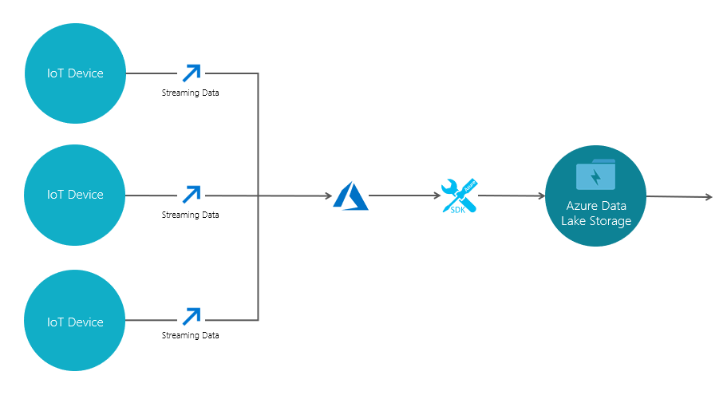
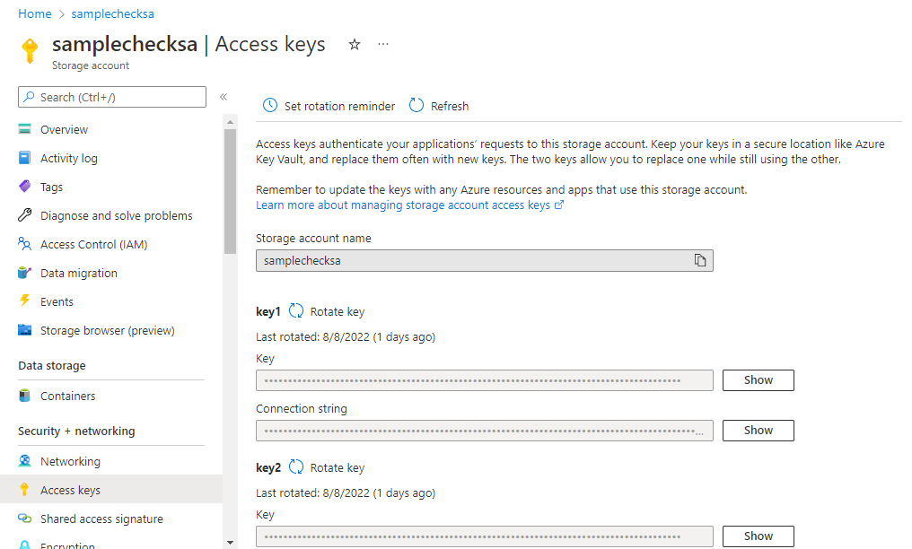

# Ingest IoT data into ADLS

This project stores the streaming IoT data into ADLS gen2 storage account written in Python. The data would be stored in files of our desired format. Data from multiple IoT devices would be processed parallelly and stored in their respective destinations(ADLS) as per the given conventions.

# Getting Started


## Download

```
pip install azure-iot-device
pip install azure-storage-file-datalake
```

## Design

Using Azure SDKs and storage account credentials, we interact with the storage



## Requirements

- An Azure Data Lake Storage Gen2 account [ADLS Gen2 account creation](https://docs.microsoft.com/en-us/azure/storage/blobs/create-data-lake-storage-account) .

- Get the following ADLS account credentials and replace them accordingly in their respective fields in `configurations.py` file. 

    


```
configurations.py

config['Azure_Credentials'] = {
    'SAConnectionString' : '<Connection string>',
    'AzureSAName' : '<Storage account name>',
    'AzureSAAccessKey' : '<Key>', 
    }
```

- Find your storage account credentials.
    
    


- Add your preferred IoT devices in the `Devices.py` file.

  - > **Strictly one class per device**.
  - Every Device's logic must start in the **run** method of that particular device class. Later, free to add any further utility methods in the class. 
  - If any authorization credentials are applicable to the device, add them in `configurations.py` file as shown below and run it once.
  ```
  configurations.py

  config['<class-name>'] = {
    'key' : '<value>',
    'key' : '<value>',
    }
  ``` 
  \<class-name\>   - Name of the class that you give to that particular device.\
  \<keys and values\> - Credentials and fields related to that device.

```
Devices.py

class <class-name>:
    def __init__(self):
        self.outd = []
        self.directory = self.__class__.__name__
        self.file = self.directory+"-data.json"
    
    def run(self):

        while True:
            
            --Add your logic to catch the IoT device data into outd array here--

            global a
            if a == self.directory:
                global b
                b += 1
                azure_Handle().saving_data_in_storage(self.outd, self.directory, self.file)
                print(f"Device {self.directory} exitted successfully.")
                sys.exit()
            time.sleep(10)
```
>
> **NOTE** : No duplicate class names allowed.
>

Suppose, I have to add a simple Temperature-Humidity simulator, the structure would be, 

```
Devices.py

class Temp_Humidity:
    
    def __init__(self):
        self.outd = []
        self.directory = self.__class__.__name__
        self.file = self.directory+"-data.json"
    
    def run(self):
        TEMPERATURE = 20.0
        HUMIDITY = 60
        while True:
            temperature = TEMPERATURE + (random.random() * 15)
            humidity = HUMIDITY + (random.random() * 20)
            MSG_TXT = {
                "temperature" : temperature,
                "humidity" : humidity}
            
            message = Message(str(MSG_TXT), content_encoding='utf-8', content_type='application/json')

            if temperature > 30:
                message.custom_properties["temperatureAlert"] = "true"
            else:
                message.custom_properties["temperatureAlert"] = "false"
            
            if message.custom_properties:
                MSG_TXT.update(message.custom_properties)

            self.outd.append(str(MSG_TXT))        
            
            print("Sending message: {}".format(MSG_TXT))
            
            global a
            if a == self.directory:
                global b
                b += 1
                azure_Handle().saving_data_in_storage(self.outd, self.directory, self.file)
                print(f"Device {self.directory} exitted successfully.")
                sys.exit()
            time.sleep(10)
```


## Running

Once done with all the prereqisites, run the `main.py` file.

- A list of existing containers in the provided storage account would be shown first and then, user would be prompted to enter the name of the container to store the data. User can enter the name of an existing container or a new one too.

```
Existing containers in the selected storage account are listed below.
container-1
container-2

Enter the name of the container of your choice to work on (Existing/New) :
```

- Later, user would be shown the list of available devices in the project and then would be prompted to select the devices to run.    

```
Enter the respective id of the devices you would like to run as space separated integers

Available Devices :
id | Devices
-----------------
1  |  Device-1
2  |  Device-2
3  |  Device-3

Here : 
```

`Here : 1 2 3` - To run the devices 1,2,3

- Once user select the devices, catching device's data starts and user will be parallely be prompted as shown below, which asks for respective device name(or class name of that particular device) to exit.

`Enter the name of the Device and hit 'Enter' to exit : `

